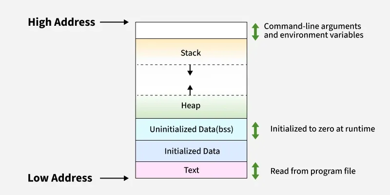

# Assembly

## Understanding binaries

To understand how to write binaries or how vulnerabilites come about, it helps to understand how binaries are stored and executed.

A binary file is broken down into 7 subsections:

### .text

Purpose: The *Text Section* contains machine instructions that will be executed during runtime. It stores also stores functions to be executed. If attempting to write to this section, it will throw an access violation. Due to it being determined at compile time, the size of this section is fixed.

Order: Lower Address to Higher Address

Access: **read** ~~write~~ **execute**

### .data

Purpose: The *Data Section* contains defined global static variables. It is fixed at **compile time**.

Access: **read** ~~write execute~~

Order: Lower Address to Higher Address

### .bss

Purpose: The *Below Stack Section* contains undefined global variables. It is also fixed at **compile time**. It is defined to be `0b` during compilation using zero-fill-on-demand to remove data that may have been leftover from other processes. 

Access: **read write** ~~execute~~

Order: Lower Address to Higher Address

### heap

Purpose: The *Heap* is used to store dynamically allocated variables. In C, memory is allocated to the heap using `malloc()`, `realloc()` and removed from the heap using `free()`. This allows memory allocation at **runtime**. Allowing execution in the `heap` could allow an attack to run shell commands.

Access: **read write** ~~execute~~

Order: Lower Address to Higher Address

### buffer

Purpose: The *Buffer* is storage allocated to data that is not currently handled by a process. Each process has it's respective buffer set, and is of fized size. Since each buffer block can hold many buffers, the memory addresses of them are stored in [.data](#data) or [.bss](#bss).

Access: **read write** ~~execute~~

Order: Lower Address to Higher Address

### stack

Purpose: The *Stack* is used to keep track of function calls. If a process is multi-threaded, it is allocated a unique stack. Due to the memory allocated being from a higher address to a lower address, it allows for buffer overflows.

Access: **read write execute**

Order: Higher Address to Lower Address

### env variables and args

Purpose: The *Environment/Arguments Section* stores a copy of system-level variables that may or may not be required during runtime. Such would include the **PATH**, **SHELL NAME**, **HOSTNAME** or any command line arguments. This section is also prone to format string and buffer overflow exploits.

Access: **read write** ~~execute~~

Order: Higher Address to Lower Address